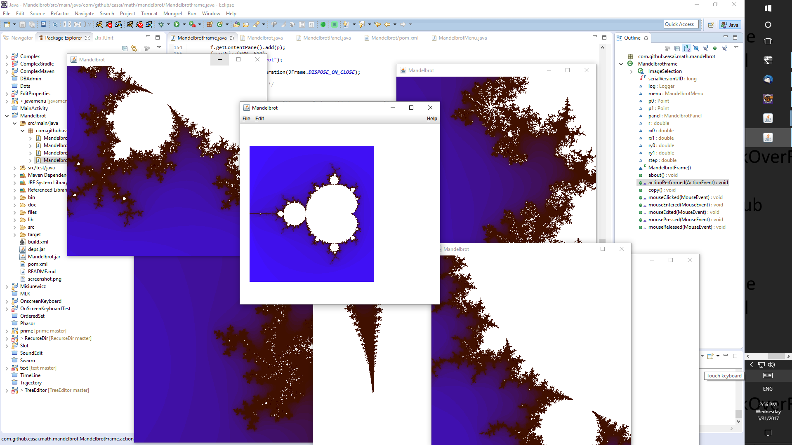

# Mandelbrot



You can yous Maven for this project.  Download the project and compile as follows.  The JAR files will be created under target directory.
```
> git clone https://github.com/easai/Mandelbrot
> cd Mandelbrot
> mvn package
> cd target
> java -jar Mandelbrot-0.0.1-SNAPSHOT-jar-with-dependencies.jar
```
Or, alternatively, you can use ant as follows.
```
> git clone https://github.com/easai/Mandelbrot
> cd Mandelbrot
> ant
> java -jar Mandelbrot.jar
```
